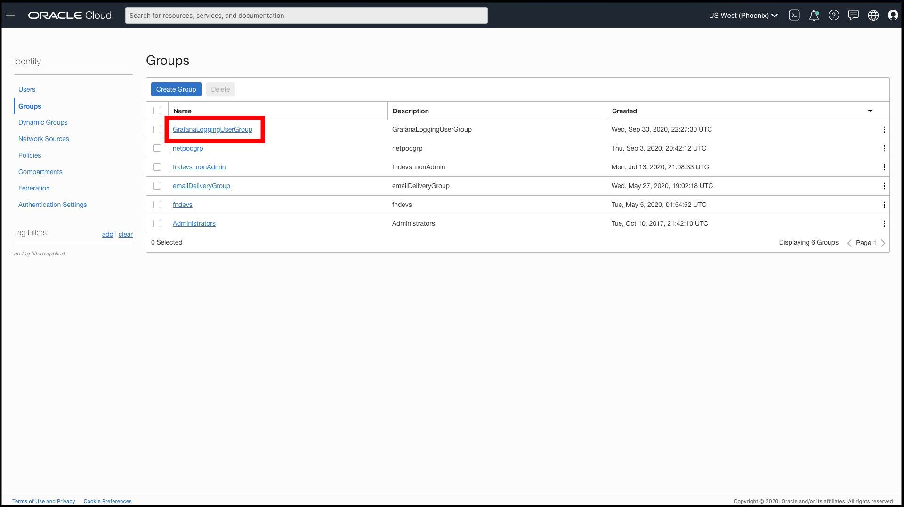
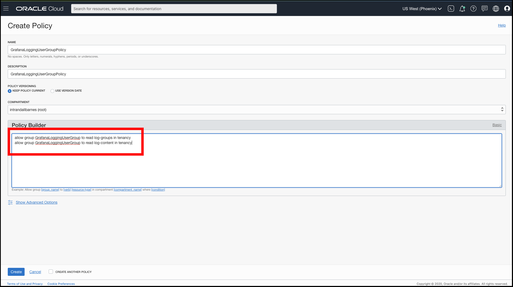

# Local Installation (MacOS) - Oracle Cloud Logging Data Source for Grafana

## Background

Grafana is a popular technology that makes it easy to visualize metrics and logs. The Oracle Cloud Infrastructure Grafana Plugin for OCI Logging can be used to extend Grafana by adding OCI Logging as a data source. The plugin allows you to retrieve logs related to a number of OCI resources: Compute, Networking, Storage, and custom logs. Once in Grafana logs can be analysed along with metrics, giving us single pane of glass for application monitoring. 

This walkthrough is intended for those who want to deploy Grafana and the OCI Logging service as a data source on a local server.

Make sure you have access to the Logging service configured for the resources you want to fetch logs for.

For custom logs from your application, see [Custom Logging on OCI](https://docs.cloud.oracle.com/en-us/iaas/Content/Logging/Concepts/custom_logs.htm).

## Install the Oracle Cloud Infrastructure CLI 

The [Oracle Cloud Infrastructure CLI](https://docs.cloud.oracle.com/iaas/Content/API/Concepts/cliconcepts.htm) provides you with a way to perform tasks in OCI from your command line rather than the OCI Console. It does so by making REST calls to the [OCI APIs](https://docs.cloud.oracle.com/iaas/Content/API/Concepts/usingapi.htm). We will be using the CLI to authenticate between our local environment hosting Grafana and OCI in order to pull in metrics. The CLI is built on Python (version 2.7.5 or 3.5 or later), running on Mac, Windows, or Linux.

Begin by [installing the Oracle Cloud Infrastructure CLI](https://docs.cloud.oracle.com/iaas/Content/API/SDKDocs/cliinstall.htm). Follow the installation prompts to install the CLI on your local environment. After the installation is complete, use the `oci setup config` command to have the CLI walk you through the first-time setup process. If you haven't already uploaded your public API signing key through the console, follow the instructions [here](https://docs.us-phoenix-1.oraclecloud.com/Content/API/Concepts/apisigningkey.htm#How2) to do so. 

## Configure OCI Identity Policies

In the OCI console under **Identity > Groups** click **Create Group** and create a new group called **GrafanaLoggingUserGroup**. Add the user configured in the OCI CLI to the newly-created group. 



Under the **Policy** tab switch to the root compartment and click **Create Policy**. Create a policy allowing the group to read tenancy metrics. Add the following policy statements:

- `allow group GrafanaLoggingUserGroup to read log-groups in tenancy`
- `allow group GrafanaLoggingUserGroup to read log-content in tenancy`



## Install Grafana and the OCI Logging Data Source for Grafana Plugin 

To [install the data source](https://grafana.com/plugins/oci-datasource/installation) make sure you are running [Grafana 3.0](https://grafana.com/get) or later.
On a MacOS system run: `brew install grafana`. 
Use the [grafana-cli tool](http://docs.grafana.org/plugins/installation/) to install the Oracle Cloud Logging Data Source for Grafana from the command line:

```
grafana-cli plugins install oci-logging-datasource
```
**NOTE** Today the latest version of the plugin is available only with the manual installation

The plugin will be installed into your Grafana plugins directory, which by default located at /var/lib/grafana/plugins. [Here is more information on the CLI tool](http://docs.grafana.org/plugins/installation/).

### Manually installation 
 Alternatively, you can manually download the .tar file and unpack it into your /grafana/plugins directory. To do so, change to the Grafana plugins directory: `cd /usr/local/var/lib/grafana/plugins`. Download the OCI Grafana Plugin: wget `https://github.com/oracle/oci-grafana-plugin/releases/download/v2.0.0/plugin.tar`. Create a directory and install the plugin: `mkdir oci && tar -C oci -xvf plugin.tar` and then remove the tarball: `rm plugin.tar`

>  **Additional step for Grafana 7**. Open the grafana configuration  *grafana.ini* file and add the `allow_loading_unsigned_plugins = "oci-logging-datasource"`in the *plugins* section.

*Example* 
```
    [plugins]
    ;enable_alpha = false
    ;app_tls_skip_verify_insecure = false
    allow_loading_unsigned_plugins = "oci-logging-datasource"
```


To start the Grafana server, run: `brew services start grafana`

Navigate to the Grafana homepage at http://localhost:3000.


## Configure Grafana


Log in with the default username `admin` and the password `admin`. You will be prompted to change your password. Click **Skip** or **Save** to continue. 


On the Home Page of Grafana, click **Add data source**.


Here you will see **Search Box** as shown below


Search with **Oracle Cloud Infrastructure Logs** as your data source type.


Fill in your **Tenancy OCID**, **Default Region**, and **Environment**. For **Environment** choose **local**. 

Click **Save & Test** to return to the home dashboard. 


## Next Steps

See how to use the newly installed and configured plugin in our Using Grafana with Oracle Cloud Infrastructure Logs Data Source[TODO] walkthrough.

